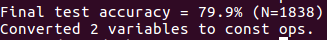

# Tensorflow Traffic Light Image Classifier
Repository developed using [TensorFlow For Poets Codelab](https://codelabs.developers.google.com/codelabs/tensorflow-for-poets/#0) and [Nexar Dataset](https://challenge.getnexar.com/challenge-1).

## Requirements
* [Docker](https://www.docker.com/)
* Linux or OS X

## Usage
1. Start docker image `docker run -it -v $HOME/tf_files:/tf_files  gcr.io/tensorflow/tensorflow:latest-devel`
2. Run python script to label your image `python /tf_files/label_image.py <path_to_image>`

## Results
### Accuracy - 79.9%
